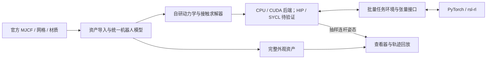

# 技术路线：计算后端、训练接口与可视化

更新日期：2026-09-09。状态：工程建议，尚未实施或通过可行性验证。

## 1. 多厂商 GPU 路线

推荐先验证 **C++ + Kokkos**：统一物理算法与数据结构，按目标设备编译后端。

| 路线 | 能解决的问题 | 本项目的取舍 |
| --- | --- | --- |
| Kokkos | C++ 并行执行与内存抽象，提供 Serial/OpenMP、CUDA、HIP、SYCL 等后端 | 首选验证对象，共享 CPU/GPU 求解器代码 |
| SYCL / AdaptiveCpp | 跨设备 C++ 编程与编译方案 | 候选；需验证编译器、驱动与张量互操作 |
| 原生 C++/CUDA，后续 HIP 移植 | 先完成 NVIDIA，再移植到 AMD | 回退路线；CPU 路径仍需实现，移植需要人工适配 |

依据：[Kokkos 执行空间](https://kokkos.org/kokkos-core-wiki/API/core/execution_spaces.html)、[Khronos SYCL](https://www.khronos.org/sycl/)、[AdaptiveCpp](https://github.com/AdaptiveCpp/AdaptiveCpp)、[AMD HIP](https://rocm.docs.amd.com/projects/HIP/en/latest/what_is_hip.html)。核对日期均为 2026-09-09。

推荐映射为 CPU → Serial/OpenMP，NVIDIA → CUDA，AMD → HIP，Intel → SYCL。具体设备和工具链须符合所选版本支持条件。代码可移植不代表单个二进制通吃设备，也不保证性能一致。

Apple GPU 加速不纳入当前承诺；Mac 用于编辑与浏览器显示。CPU/CUDA 运行验收首先在远端完成。AMD/Intel 在没有对应硬件实测前标记为“计划支持”。

### 可行性验证

1. 检查远端编译器、CUDA Toolkit 和 PyTorch，再锁定 Kokkos 版本。当前非交互 SSH 的 PATH 未找到 `nvcc`，不能仅凭驱动判定已有 CUDA 编译环境。
2. 用同一数学算子完成远端 CPU/CUDA 构建、执行和数值对照，先规定容差。
3. 验证与 PyTorch 同设备缓冲区共享、所有权和 stream/event 同步，避免每个环境步搬运整批状态回 CPU。
4. 用代表性小矩阵、归约和接触处理原型测量开销，不预先承诺环境数量或训练速度。

可修复的工具链问题先修复；若核心互操作或性能条件仍不满足要求，记录证据并回退原生 C++/CUDA。版本条件参考：[Kokkos Requirements](https://kokkos.org/kokkos-core-wiki/get-started/requirements.html)。

## 2. 自研引擎职责

建议由本项目实现动力学、碰撞与接触求解、关节约束、积分、控制和批量环境。Kokkos 是并行编程工具，rsl-rl 是学习库；Python 可以用于配置、资产转换与训练入口。

初始范围建议聚焦 MicroDuck、平地与刚体接触。通用 MJCF、任意机器人、复杂地形和实机部署另行确定。资产导入应明确支持的 MJCF 子集，对不支持的语义显式报错。

MuJoCo 可作为资产解释或数值对照工具的候选，是否引入该开发依赖再决定；上游物理步进不能被标成自研求解器能力。

## 3. rsl-rl 接入

- 锁定版本后以实际环境接口为准，定义 reset/step、观测、奖励、终止与超时信息。
- 明确批维、dtype、设备、关节顺序、单位、坐标系、四元数顺序和控制周期，不直接以官网电机数推导动作维度。
- 仿真与策略尽量位于同一 GPU，通过兼容的张量接口共享缓冲区，并验证生命周期和异步同步。
- CUDA 成功仅证明 CUDA 路径；AMD/Intel 仍需分别验证 PyTorch、rsl-rl 与物理后端的组合。
- 短训练检查 NaN、重置、终止/超时、模型保存加载与确定条件下的回放。

框架来源：[RSL-RL](https://github.com/leggedrobotics/rsl_rl)。这些是设计和验证要求，当前没有接口实现。

## 4. 官方资产

上游：[pollen-robotics/microduck_rl](https://github.com/pollen-robotics/microduck_rl)。本次核对提交：`1e79c29c97d8b38aee9eefde77a545860ba7658e`。

模型目录为 `src/mjlab_microduck/robot/microduck/`：

- `robot_allcollisions.xml`：本次检查的模型，包含外观网格、材质、刚体、惯性与关节定义。
- `robot_walk.xml`：步行变体，需比较后选择。
- `scene.xml`、`scene_walk.xml`：场景入口。
- `assets/*.stl`：外观和结构网格。
- 上一级 `microduck_constants.py`：初始姿态、模型选择和执行器配置参考。

静态 XML 检查发现 38 个 mesh、38 个 material、14 个关节及 14 个执行器，另有自由基座。meshdir 为 `assets`，角度为弧度。网格引用已与目录树核对；尚未下载网格或编译模型。

官网标称 15 个电机；该模型定义 14 个关节执行器。物理自由度、动作维度与实机电机映射需要分别核实。来源：[官网](https://pollen-robotics.com/microduck/)、[已检查模型](https://github.com/pollen-robotics/microduck_rl/blob/1e79c29c97d8b38aee9eefde77a545860ba7658e/src/mjlab_microduck/robot/microduck/robot_allcollisions.xml)。

上游 README 区分软件 Apache-2.0 与 3D 模型 Creative Commons BY-SA-NC。导入资产时保留原始许可和署名，核对具体模型许可文件，不能统一标为 Apache-2.0。依据：[上游许可说明](https://github.com/pollen-robotics/microduck_rl#license)。

## 5. 完整可视化

建议采用 **独立 Three.js 浏览器查看器 + 官方网格与材质 + 远端姿态数据**。当前尚无查看器或渲染截图。

导入时展开 MJCF 层级、局部变换、网格缩放、关节轴及默认属性，保留 mesh 与材质映射。显示资源可转换为带节点层级的 GLB；刚体有稳定 ID，静态资产与动态姿态使用同一映射。Three.js 提供 [GLTFLoader](https://threejs.org/docs/pages/GLTFLoader.html)。

默认显示头壳、面部与眼睛、嘴部、机身、颈部、双腿与脚等完整外观。STL 导入后应用 XML 的材质；碰撞形状作为可切换调试叠层，物理几何简化不应删除外观部件。

远端训练无窗口运行，只抽样少量环境的连杆世界位姿供查看。资产在本机缓存，姿态通过 SSH 隧道连接的服务传输；离线轨迹可由同一查看器回放。渲染频率独立于物理步长与策略频率，关闭窗口不影响训练。

### 验收要求

- 所选模型全部外观网格成功加载；缺件、材质及引用错误显式显示。
- 正面、侧面与斜视角完整辨认形状和配色，保存画面与官方形象对照。
- 关节滑条检查可动关节；轴向、限位、父子关系及初始姿态正确。
- 支持旋转、缩放、重置视角与碰撞叠层；默认画面不被调试线框遮挡。
- 接入状态后，刚体 ID、世界坐标和时间戳一致；支持暂停回放，断开查看器不阻塞仿真。

静态装配和关节交互先验收，远端实时姿态与轨迹回放随后接入。外观通过后仍需独立验证动力学。
