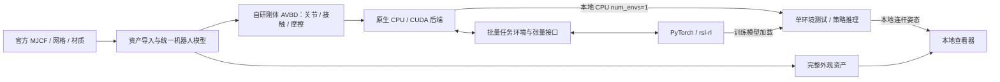

# 技术路线：计算后端、训练接口与可视化

更新日期：2026-09-09。状态：原生 CPU/CUDA 与刚体 AVBD 主线已确认，尚未实现或通过可行性验证；其余建议保留明确状态。

## 1. 原生 CPU/CUDA 路线（已确认）

用户最新明确采用 CUDA，同时支持 CPU 求解。此前 Kokkos/多厂商优先建议已撤回当前实施计划；这是需求调整，不是性能测试结论。

- CPU 使用原生 C++，CUDA 使用原生 CUDA C++；两者完整支持仿真求解，不把 CPU 缩减为数据准备或仅查看模型。纯 CPU 代码、CPU 求解与渲染测试可在 Mac 本地编译运行。
- GPU 代码优先在 `master172:/public/yekq6Data/codex`、连接不可用时在 `delltower:/home/yekeqi/Documents/HDD1/codex` 运行；每次先 scp/rsync 同步至项目工作目录，再远端编译运行。源码副本、构建与结果布局见 [运行约定](REMOTE_EXECUTION.md)。
- 共享刚体 AVBD 的数学定义、六维局部块、关节与接触模型、乘子更新、积分规则和误差指标，分别优化 CPU 循环和 CUDA 批量执行。
- CPU FP64 作为数值参考；CPU/CUDA 同精度对照用于分离后端差异与精度差异。
- 先核实远端 CUDA Toolkit 与编译器。本次记录中非交互 SSH 的 PATH 未找到 `nvcc`，其他安装位置尚未调查。
- 分别验证 CPU/CUDA 构建运行及 PyTorch 缓冲区互操作、生命周期和 stream/event 同步。
- 不预先保证速度或逐位一致；基准需包含接触求解、重置及训练数据交互。

Articulation 已选定 **刚体 AVBD**，详见 [求解器方案](ARTICULATION_SOLVER.md)。每个刚体采用最大坐标位姿和六维局部增量，关节以增广拉格朗日约束连接，接触与摩擦进入同一分块迭代框架。乘子调度、惩罚参数、摩擦模型和收敛阈值仍需推导与验证。

首版顺序：单刚体 → hinge 双摆 → 限位与受限力矩电机 → 足底接触与摩擦 → MicroDuck 支撑 → 批量训练。CRBA/ABA 可作为未来独立对照；SAP 不作为每步串联的接触求解器。

## 2. 自研引擎职责

建议由本项目实现动力学、碰撞与接触求解、关节约束、积分、控制和批量环境。rsl-rl 是学习库；Python 可以用于配置、资产转换与训练入口。

初始范围建议聚焦 MicroDuck、平地与刚体接触。通用 MJCF、任意机器人、复杂地形和实机部署另行确定。资产导入应明确支持的 MJCF 子集，对不支持的语义显式报错。

MuJoCo 可作为资产解释或数值对照工具的候选，是否引入该开发依赖再决定；上游物理步进不能被标成自研求解器能力。

## 3. rsl-rl 接入

- 锁定版本后以实际环境接口为准，定义 reset/step、观测、奖励、终止与超时信息。
- `num_envs` 是并行独立环境个数，对应观测/动作等张量的环境批维；终止与重置按环境分别处理。环境数量、求解设备和渲染开关互不替代。
- 明确批维、dtype、设备、关节顺序、单位、坐标系、四元数顺序和控制周期，不直接以官网电机数推导动作维度。
- 仿真与策略尽量位于同一 GPU，通过兼容的张量接口共享缓冲区，并验证生命周期和异步同步。
- CPU/CUDA 分别验证完整环境、求解器与 PyTorch/rsl-rl 的组合，不能用一条路径代替另一条的验收。
- 短训练检查 NaN、重置、终止/超时、模型保存加载与确定条件下的回放。

框架来源：[RSL-RL](https://github.com/leggedrobotics/rsl_rl)。这些是设计和验证要求，当前没有接口实现。

## 4. 官方资产

上游：[pollen-robotics/microduck_rl](https://github.com/pollen-robotics/microduck_rl)。本次核对提交：`1e79c29c97d8b38aee9eefde77a545860ba7658e`。

模型目录为 `src/mjlab_microduck/robot/microduck/`：

- `robot_allcollisions.xml`：本次检查的模型，包含外观网格、材质、刚体、惯性与关节定义。
- `robot_walk.xml`：步行变体，需比较后选择。
- `scene.xml`、`scene_walk.xml`：场景入口。
- `assets/*.stl`：外观和结构网格。
- 上一级 `microduck_constants.py`：初始姿态、模型选择和执行器配置参考。

静态 XML 检查发现 38 个 mesh、38 个 material、14 个关节及 14 个执行器，另有自由基座。meshdir 为 `assets`，角度为弧度。网格引用已与目录树核对；尚未下载网格或编译模型。

官网标称 15 个电机；该模型定义 14 个关节执行器。物理自由度、动作维度与实机电机映射需要分别核实。来源：[官网](https://pollen-robotics.com/microduck/)、[已检查模型](https://github.com/pollen-robotics/microduck_rl/blob/1e79c29c97d8b38aee9eefde77a545860ba7658e/src/mjlab_microduck/robot/microduck/robot_allcollisions.xml)。

上游 README 区分软件 Apache-2.0 与 3D 模型 Creative Commons BY-SA-NC。导入资产时保留原始许可和署名，核对具体模型许可文件，不能统一标为 Apache-2.0。依据：[上游许可说明](https://github.com/pollen-robotics/microduck_rl#license)。

## 5. 本地推理与单 CPU env 可视化

**可视化范围已确认：只需在推理或单个 CPU 环境下实现，方便在 Mac 本地查看。** GPU 多 env 训练无窗口运行，当前不要求训练过程实时渲染、远端姿态流或同时显示全部训练环境。

### env 的含义与配置

`num_envs` 表示并行独立仿真环境的个数。例如 `num_envs=1` 是单个环境，`num_envs=N` 是 N 个独立环境。每个环境独立维护物理状态、接触、奖励、终止和重置，可共享只读机器人资产。

| 使用场景 | 求解位置与后端 | 环境数量 | 可视化 |
| --- | --- | --- | --- |
| GPU 批量训练 | 指定 SSH 远端，CUDA | `num_envs=N`，N 按任务和资源设置 | 关闭 |
| 本地单环境测试 | Mac，CPU | `num_envs=1` | 可开启 |
| 本地策略推理 | Mac，CPU 仿真与 CPU 策略推理 | 默认 `num_envs=1` | 可开启 |

`num_envs=1` 不限制 CPU 核数或线程数，也不表示 CPU 求解器只能支持一个环境。CPU 指物理求解后端，查看器可使用本机图形能力，不依赖 CUDA。推理可视化以本地 CPU 单环境作为首个实现目标。

### 本地显示方案

建议采用 **本地 Three.js 浏览器查看器 + 官方网格/材质 + 本地环境姿态**。当前尚无查看器或渲染截图。

导入时展开 MJCF 层级、局部变换、网格缩放、关节轴及默认属性，保留 mesh 与材质映射。显示资源可转换为带节点层级的 GLB；刚体使用稳定 ID，本地 CPU 仿真直接提供各连杆位姿。Three.js 提供 [GLTFLoader](https://threejs.org/docs/pages/GLTFLoader.html)。

默认显示头壳、面部与眼睛、嘴部、机身、颈部、双腿与脚等完整外观。STL 导入后应用 XML 材质，碰撞形状作为可切换调试叠层。

远端训练完成后，将模型、观测归一化统计和必要配置同步到 Mac，再在本地 CPU 环境中执行策略推理。动作/观测顺序、缩放、控制周期与机器人资产版本保持一致；checkpoint 或导出格式在锁定 rsl-rl 版本后确定。该流程无需远端持续在线传输姿态。

渲染频率与物理步长、策略频率分开控制。求解器在关闭渲染时仍完整运行，批量训练不初始化查看器或传输渲染数据。

### 验收要求

- Mac 本地可以加载完整 MicroDuck，在单 CPU env 中显示物理状态；缺件、材质及引用错误显式报告。
- 正面、侧面与斜视角完整辨认外观与配色，并保存对照画面。
- 关节交互能检查轴向、限位、父子关系及初始姿态；支持旋转视角、缩放、重置视角与碰撞叠层。
- 加载训练模型后，能够在本地 CPU 单环境中推理并显示运动，观测归一化与动作映射正确。
- 支持暂停、单步和重置；关闭渲染仍可正常推进环境。
- GPU 多 env 训练无需窗口，环境状态与重置互不影响；单 CPU env 可视化通过不代替批量训练验收。

先验收本地静态资产与关节交互，再接入单 CPU env，最后验证训练模型的本地推理显示。物理准确性仍按 [AVBD 求解器路线](ARTICULATION_SOLVER.md) 独立验收。
